# MicroBiotR: microbiota flow cytometry and downstream analysis in R

MicroBiotR turns gated microbial flow cytometry events into a shared [self-organizing map (SOM)](https://cran.r-project.org/package=kohonen), sample-level cluster abundances, statistical comparisons and exploratory figures. It also provides feature selection, random forest diagnostics, and utilities for inspecting and exporting selected flow populations. Numeric 16S and transcriptomic feature tables can enter the downstream workflow without SOM training.

## Key features

Blue parallelograms show user inputs, amber ovals show functions or scripts, and green rectangles show outputs. Function boxes include the corresponding tutorial step numbers. The 16S and RNA tutorials (steps 14 and 15) supply feature tables to the downstream analyses. Gating is an optional preparation workflow before step 1.

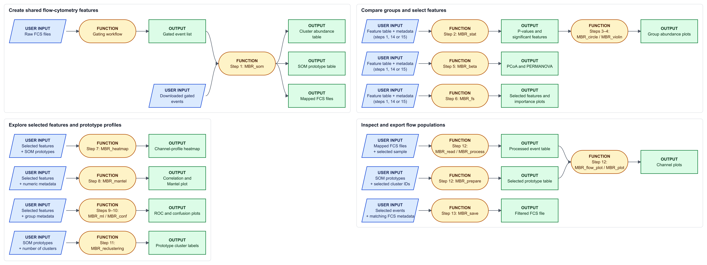

## Installation

Install the supporting R packages before installing MicroBiotR.

``` r
# Uncomment this line if devtools is not installed.
# install.packages("devtools")
# Install the Mantel-test and correlation visualization package.
devtools::install_github("Hy4m/linkET", force = TRUE)
# Check the installed linkET version.
packageVersion("linkET")

# Check whether the Bioconductor package manager is available.
if (!require("BiocManager", quietly = TRUE))
    # Install BiocManager when it is unavailable.
    install.packages("BiocManager")
# Install the metadata structures used with cytometry objects.
BiocManager::install("Biobase")

# Install the color scales used in flow cytometry plots.
install.packages("viridis")

# Install Biobase from its GitHub repository.
devtools::install_github("Bioconductor/Biobase", force = TRUE)
# Install BiocManager using the CRAN repository.
install.packages("BiocManager", repos = "https://cran.R-project.org")
# Install tools for reading and writing FCS files.
BiocManager::install("flowCore")
```

Install MicroBiotR from [GitHub](https://github.com/changlabs/MicroBiotR) with the following R commands.

``` r
# Uncomment this line if devtools is not installed.
# install.packages("devtools")
# Download and install MicroBiotR from GitHub.
devtools::install_github("changlabs/MicroBiotR")
# Check the installed MicroBiotR version.
packageVersion("MicroBiotR")
```

## Download the example dataset

The examples cover microbial flow cytometry, 16S feature abundances and bulk RNA expression. The flow cytometry example uses data acquired with a **BD Influx** instrument. `CD`, `HC` and `UC` denote Crohn's disease, healthy controls and ulcerative colitis.

Download the data and matched metadata from [Zenodo](https://doi.org/10.5281/zenodo.20286378). Under **Files**, select the pair needed for your analysis and save both files in your R working directory. The cytometry file contains already gated events, so it is ready for SOM analysis.

| Analysis | Data | Matched metadata | Approximate data size |
|------------------|------------------|------------------|------------------|
| Microbial flow cytometry | [data_gated.save](https://zenodo.org/records/20286378/files/data_gated.save?download=1) | [meta.txt](https://zenodo.org/records/20286378/files/meta.txt?download=1) | 538.7 MB |
| 16S feature abundances | [bac_data.txt](https://zenodo.org/records/20286378/files/bac_data.txt?download=1) | [bac_meta.txt](https://zenodo.org/records/20286378/files/bac_meta.txt?download=1) | 0.26 MB |
| Bulk RNA expression | [rnaibd.csv](https://zenodo.org/records/20286378/files/rnaibd.csv?download=1) | [meta_rna.txt](https://zenodo.org/records/20286378/files/meta_rna.txt?download=1) | 36.5 MB |

Run the examples in sequence for the cytometry workflow. Study-specific cluster IDs, sample indices and feature counts should be chosen for your dataset. Each function's help is available through `?<function_name>`, for example `?MBR_som`.

## 1. SOM analysis

A [self-organizing map (SOM)](https://cran.r-project.org/package=kohonen) represents similar flow events with shared multichannel prototypes. Mapping each sample to the same prototypes creates comparable cluster abundance profiles. Channel scales influence the fit, and training can require substantial time and memory.

``` r
# The default grid has 2025 nodes; n_hclust is unused.
# Samples below 200000 events are removed before training.
# Check metadata row order against count_table before downstream analyses.

# Load the analysis and visualization functions.
library(MicroBiotR)
# Load Mantel-test and correlation visualization utilities.
library(linkET)
# Load cytometry metadata accessors.
library(Biobase)
# Load tools for reading and writing FCS files.
library(flowCore)
# Load data import, transformation and table-management utilities.
library(tidyverse)

# Load matched sample metadata.
# Read sample metadata with the first column as sample identifiers.
meta<-read.delim('meta.txt',header = T, row.names = 1)

# Load fl_data_ig, the list of gated single-cell sample matrices.
load(file.path("data_gated.save"))
# Set the random seed for reproducible sampling or fitting.
set.seed(2025)
# Run MBR_som with the inputs and settings below.
MBR_som(fl_data_ig)
```

## 2. Statistics

Compare feature abundances between groups using a [Wilcoxon rank-sum test](https://stat.ethz.ch/R-manual/R-devel/library/stats/html/wilcox.test.html). [False discovery rate (FDR)](https://stat.ethz.ch/R-manual/R-devel/library/stats/html/p.adjust.html) adjustment accounts for testing many features. Interpret associations at the biological sample level and consider the compositional nature of relative abundances.

``` r
# Test options are 'wilcox', 'kruskal', 'anova', 't.test' or 'ttest'.
# correction could be one of 'none', 'fdr', 'bonferroni' ,'BH'
# Run MBR_stat with the inputs and settings below.
MBR_stat(data = count_table, group_col = 'Group', meta_data = meta,
       # Use the two-sided Wilcoxon group test.
       test_type = 'wilcox', out_path = './',
       # Set whether feature-wise p-values are adjusted for multiple tests.
       correction = 'fdr', cutoff = 0.001)
```

## 3. Circular heatmap

A circular heatmap summarizes average abundance in each group. The difference track helps identify clusters with contrasting group means; it is a descriptive display rather than an additional hypothesis test.

``` r
# Generate a circular plot to visualize significant features across groups
# Run MBR_circle with the inputs and settings below.
MBR_circle(
  # dataframe containing features
  data = significant_data,
  # column name in metadata containing group labels
  group_col = 'Group',
  # metadata file
  meta_data = meta,
  # width of the output figure
  width = 16,
  # height of the output figure
  height = 16,
  # Write outputs to the current working directory.
  out_path = './'
# Complete the function call with the arguments above.
)
```

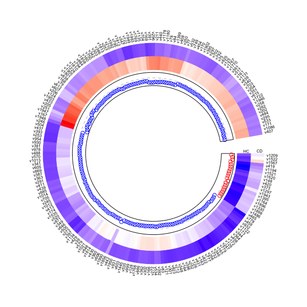

*Each labeled segment represents a SOM cluster. The two colored bands show mean relative abundance in HC and CD; the inner points show the direction of the difference between the group means.*

## 4. Cluster abundance violin plot

Inspect how one cluster is distributed across samples in each group. The violin shows distribution shape, the box plot summarizes the median and interquartile range, and the annotation displays the previously calculated adjusted p-value.

``` r
# Generate a violin plot for a selected feature/cluster
# Run MBR_violin with the inputs and settings below.
MBR_violin(
  # dataframe containing features
  data = significant_data,
  # metadata file
  meta_data = meta,
  # column name in metadata containing group labels
  group_col = "Group",
  # statistical test result dataframe containing p-values
  pvalue_data = pvalue_data,
  # column name containing adjusted p-values or raw p-values (p.value)
  p = "p.adj",
  # colors used for group visualization
  colors = c('#FFADAD', '#DEDAF4'),
  # selected feature/cluster ID for plotting
  cluster = 1948,
  # Write outputs to the current working directory.
  out_path = './'
# Complete the function call with the arguments above.
)
```

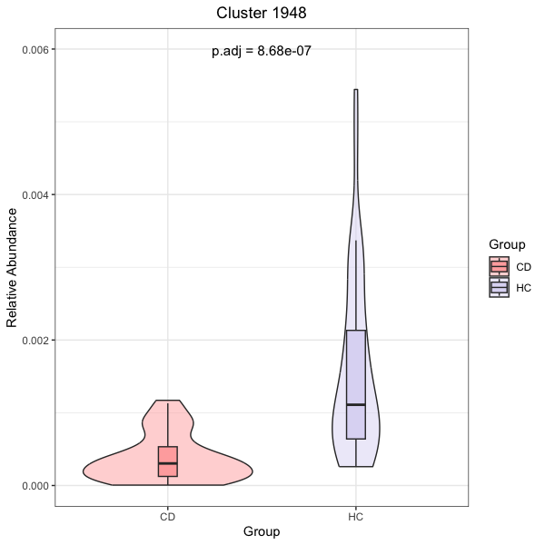

*The width of each violin reflects the sample abundance distribution; the box marks the median and interquartile range. Cluster 1948 is more abundant in HC in this example, and the annotation reports its adjusted p-value. Your selected cluster may differ.*

## 5. Beta diversity

[Bray-Curtis dissimilarity](https://vegandevs.github.io/vegan/reference/vegdist.html) compares sample abundance profiles, while [PCoA](https://stat.ethz.ch/R-manual/R-devel/library/stats/html/cmdscale.html) displays their main differences. [PERMANOVA](https://vegandevs.github.io/vegan/reference/adonis.html) tests group-associated variation in the full distance matrix; assess within-group dispersion when interpreting separation.

``` r
# The example uses group-selected significant_data; resulting group separation
# is exploratory.
# Use an unselected abundance table when testing an overall group-profile
# hypothesis.

# Perform beta diversity analysis and generate a PCoA plot
# `test` should be one of 'wilcox', 'ttest', 'kruskal', or 'anova'
# Run MBR_beta with the inputs and settings below.
MBR_beta(
  # dataframe containing features
  significant_data,
  # Write outputs to the current working directory.
  out_path = './',
  # statistical test method
  test = 'wilcox',
  # metadata file
  meta_data = meta,
  # column name in metadata containing group labels
  group_name = 'Group',
  # colors used for group visualization
  colors = c('#FFADAD', '#DEDAF4')
# Complete the function call with the arguments above.
)
```

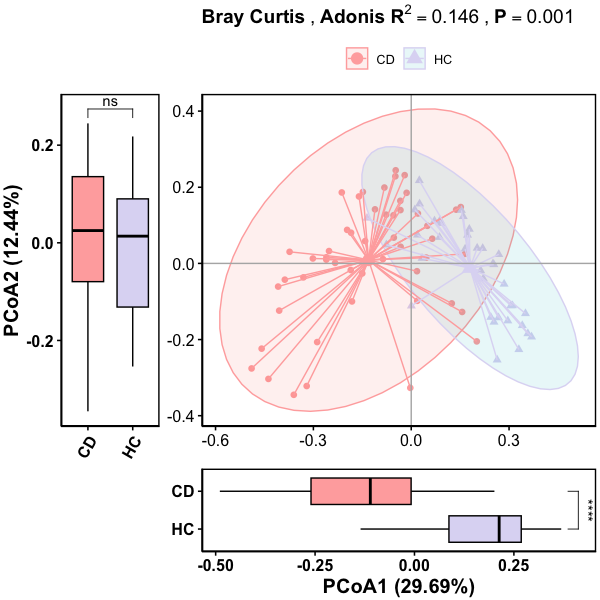

*Each point is a sample, with color and shape identifying CD or HC. Ellipses summarize the group distributions, and marginal box plots compare the two coordinate scores. The title reports the PERMANOVA R-squared and p-value for the full distance matrix.*

## 6. Feature selection

[Recursive feature elimination](https://topepo.github.io/caret/recursive-feature-elimination.html) compares predictor subsets through cross-validation. Importance scores and effect-size plots help explore selected features. Independent predictive evaluation requires feature selection inside an outer validation design.

``` r
# Choose rfe_size according to the number of available features.
# Cohen's d plots use log10(value + 1); effect estimates are exploratory after
# selection.

# Perform recursive feature elimination (RFE) for feature selection
# Random seeds are internally fixed for reproducibility.
# Run MBR_fs with the inputs and settings below.
MBR_fs(
  # dataframe containing features
  significant_data,
  # Write outputs to the current working directory.
  out_path = './',
  # number of folds for cross-validation
  nfolds_cv = 5,
  # Largest requested subset size; caret also evaluates the full set.
  rfe_size = 199,
  # Number of selected features displayed in the importance plot.
  top_n_features = 10,
  # column name in metadata containing group labels
  group_name = 'Group',
  # metadata dataframe corresponding to samples
  meta_data = meta,
  # reference/control group used for comparison
  ref_group = 'CD',
  # colors used for visualization plots
  colors = c('#FFADAD', '#DEDAF4')
# Complete the function call with the arguments above.
)
```

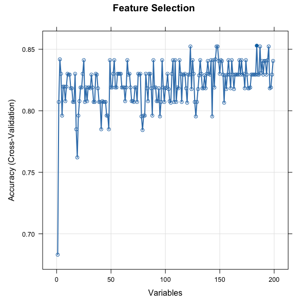

*The horizontal axis is the number of predictors evaluated, and the vertical axis is cross-validated classification accuracy. The curve shows how performance changes as predictor subsets grow; the best subset need not contain the most features.*

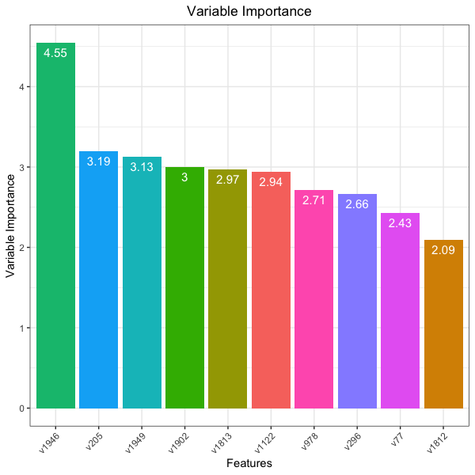

*Bar heights and numeric labels show random forest importance for the displayed SOM features. Larger scores indicate greater contribution to the fitted model; they do not establish causal or independent biological effects.*

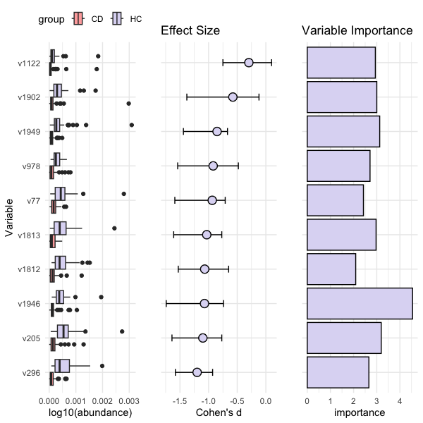

*The left panel compares transformed feature abundances in CD and HC. The middle panel shows Cohen's d with confidence intervals, whose sign depends on group ordering. The right panel shows the corresponding importance scores, aligning distributional differences with model contributions.*

## 7. SOM channel heatmap

Compare the scatter and fluorescence profiles represented by selected SOM nodes. [pheatmap](https://cran.r-project.org/package=pheatmap) displays these channel patterns, with row scaling emphasizing relative values within each node.

``` r
# The slice requires at least 184 selected features; choose a suitable subset
# for your data.
# Codebook row names must match uppercase V-prefixed feature identifiers.

# Generate a heatmap for selected features
# Run MBR_heatmap with the inputs and settings below.
MBR_heatmap(
  # selected feature matrix for visualization
  data = MBR_selected_features[,1:184],
  # cohonen clustering information
  cohonen_information = cohonen_information,
  # Write outputs to the current working directory.
  out_path = './',
  # scaling method applied to rows
  scale = 'row',
  # whether to cluster columns
  cluster_cols = FALSE,
  # whether to cluster rows
  cluster_rows = TRUE,
  # whether to display numeric values in the heatmap
  display_numbers = FALSE
# Complete the function call with the arguments above.
)
```

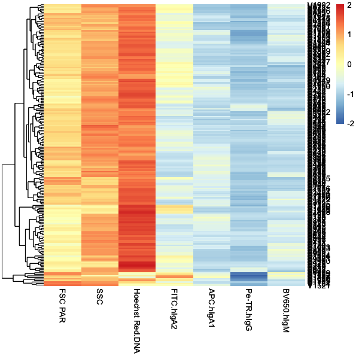

*Rows are SOM nodes and columns are measured channels, including scatter, DNA and immunoglobulin-associated fluorescence. The dendrogram groups nodes with similar profiles. The displayed color scale is standardized; set scale = "row" to view within-node standardized patterns, or use scale = "none" in the code to retain signal units.*

## 8. Metadata associations

A [Mantel test](https://vegandevs.github.io/vegan/reference/mantel.html) compares sample-distance patterns, while the correlation heatmap summarizes relationships among microbial features. [linkET](https://github.com/Hy4m/linkET) combines these summaries in one display. Treat the associations as descriptive.

``` r
# The slice requires at least ten selected features.
# Check that chosen metadata variables are numeric, finite and appropriately
# scaled.

# Perform Mantel correlation analysis between selected features and metadata
# variables
# Run MBR_mantel with the inputs and settings below.
MBR_mantel(
  # selected feature matrix
  data = MBR_selected_features[,1:10],
  # metadata file
  meta_data = meta,
  # clinical variable columns
  clinical_cols = c("Clinical1", "Clinical2"),
  # demographic variable columns
  demographic_cols = c("Demographic1", "Demographic2"),
  # Assign readable labels to the metadata blocks.
  spec_select_names = list(
    # Label the clinical metadata block.
    A = "Clinical",
    # Label the demographic metadata block.
    B = "Demographic"
  # labels used for grouped variable categories
  ),
  # Write outputs to the current working directory.
  out_path = './',
  # width of the output figure
  width = 6,
  # height of the output figure
  height = 6
# Complete the function call with the arguments above.
)
```

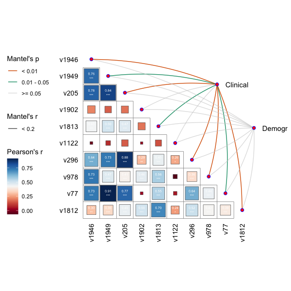

*Colored squares summarize Pearson correlations among microbial features. Links connect features to the Clinical and Demogr metadata blocks; link color groups Mantel p-values and line width groups Mantel correlation strength. These summarize different association measures.*

## 9. Random forest ROC diagnostic

The receiver operating characteristic (ROC) curve shows sensitivity across false-positive rates, and area under the curve (AUC) summarizes discrimination. See the [pROC documentation](https://cran.r-project.org/package=pROC) for ROC estimation. This diagnostic uses held-out cross-validation probabilities averaged once per sample. Tuning and prior feature selection can still make the estimates optimistic; supply `test_data` and `test_meta_data` from unused samples for independent evaluation.

``` r
# Run MBR_ml with the inputs and settings below.
MBR_ml(
  # feature table
  data = MBR_selected_features,
  # metadata file
  meta_data = meta,
  # column name in metadata containing group labels
  group_name = 'Group',
  # Write outputs to the current working directory.
  out_path = './',
  # reference group (e.g., "CD" or "HC")
  reference_level = 'CD',
  # width of the output plot PDF
  width = 6,
  # height of the output plot PDF
  height = 6,
  # resampling method
  method = 'repeatedcv',
  # number of folds
  number = 5,
  # number of repeats
  repeats = 2
# Complete the function call with the arguments above.
)
```

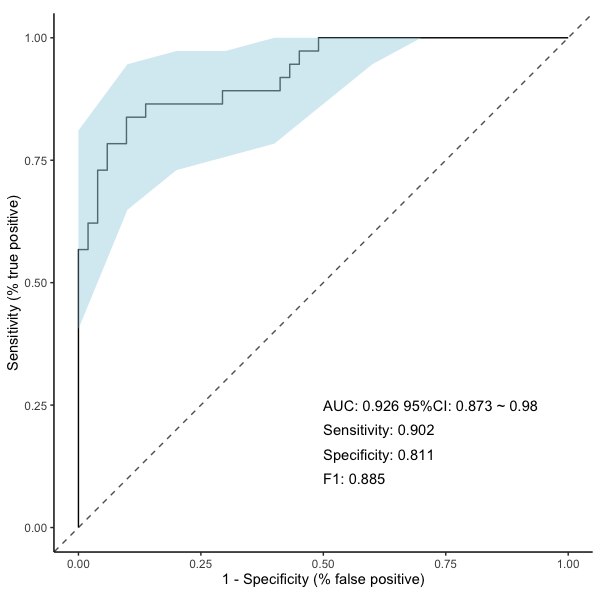

*This illustrative figure uses the example dataset; rerun the chunk to obtain the current model diagnostics. The curve plots sensitivity against the false-positive rate, and the dashed diagonal represents chance-level discrimination. The shaded band shows the sensitivity confidence interval; annotations report AUC and classification metrics. These describe this fitted example rather than independent test-set performance.*

## 10. Confusion matrix

Inspect correctly classified samples and the types of classification error. The [random forest](https://cran.r-project.org/package=randomForest) confusion display uses held-out cross-validation predictions from a separately fitted model, or an independent test set supplied with `test_data` and `test_meta_data`. Group sizes matter when interpreting the counts.

``` r
# Generate a confusion matrix and classification performance summary
# Run MBR_conf with the inputs and settings below.
MBR_conf(
  # feature table used for model evaluation
  data = MBR_selected_features,
  # metadata file
  meta_data = meta,
  # column name in metadata containing group labels
  group_name = 'Group',
  # reference group (e.g., "CD" or "HC")
  reference_level = 'CD',
  # Write outputs to the current working directory.
  out_path = './'
# Complete the function call with the arguments above.
)
```

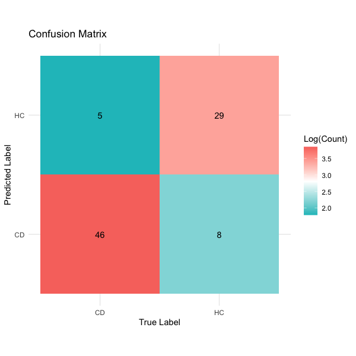

*This illustrative figure uses the example dataset; rerun the chunk to obtain the current model diagnostics. Columns indicate true groups and rows indicate predicted groups. Diagonal cells count correct predictions; off-diagonal cells count errors. Cell labels give sample counts, while color uses a logarithmic count scale.*

## 11. Reclustering

Group SOM prototypes into coarser signal profiles using standardized measurements and [Ward hierarchical clustering](https://stat.ethz.ch/R-manual/R-devel/library/stats/html/hclust.html). Cluster labels summarize similarity; they do not automatically update the mapped event assignments.

``` r
# Run MBR_reclustering with the inputs and settings below.
MBR_reclustering(data = cohonen_information, num_clusters = 1000)
```

## 12. Flow cytometry channel plots

Locate selected SOM populations in scatter and fluorescence projections. The [flowCore utilities](https://www.bioconductor.org/packages/release/bioc/html/flowCore.html) read the mapped FCS files, while density backgrounds and prototype labels show where selected populations lie. Use transformations appropriate for the acquisition scale.

``` r
# file_index = 1 requires at least 70 mapped FCS files.
# Prototype row names must match selected_rows and their order must match
# annotation labels.

# Define the directory containing 'FCS files generated from SOM processing'
# Locate mapped FCS files produced by SOM analysis.
rawdata_path <- "MappedFCS"

# Read the mapped FCS files into a flowSet.
fcs_files <- MBR_read(rawdata_path)

# Define selected SOM cluster IDs to visualize
# Choose the SOM cluster labels to inspect.
selected_rows <- c(
  # Continue the input selection or validation started above.
  'V1122','V1902','V1949','V978','V77','V1813','V1812','V1946','V205','V296'
# Complete the function call with the arguments above.
)


# Define column name mappings between FCS channels and marker names
# Map acquisition-channel names to plotting labels.
column_mapping <- c(
  # Map acquisition-channel aliases to a shared plotting name.
  "FSC PAR"         = "FSC.PAR",
  # Map acquisition-channel aliases to a shared plotting name.
  "SSC"             = "SSC",
  # Map acquisition-channel aliases to a shared plotting name.
  "Hoechst.Red.DNA" = "Hoechst.Red",
  # Map acquisition-channel aliases to a shared plotting name.
  "Hoechst.Red"     = "Hoechst.Red",
  # Map acquisition-channel aliases to a shared plotting name.
  "Hoechst Red.DNA" = "Hoechst.Red",
  # Map acquisition-channel aliases to a shared plotting name.
  "FITC.hIgA2"      = "FITC",
  # Map acquisition-channel aliases to a shared plotting name.
  "FITC"            = "FITC",
  # Map acquisition-channel aliases to a shared plotting name.
  "APC.hIgA1"       = "APC",
  # Map acquisition-channel aliases to a shared plotting name.
  "APC"             = "APC",
  # Map acquisition-channel aliases to a shared plotting name.
  "Pe-TR.hIgG"      = "Pe.TR",
  # Map acquisition-channel aliases to a shared plotting name.
  "Pe.TR.hIgG"      = "Pe.TR",
  # Map acquisition-channel aliases to a shared plotting name.
  "Pe.TR"           = "Pe.TR",
  # Map acquisition-channel aliases to a shared plotting name.
  "BV650.hIgM"      = "BV650",
  # Map acquisition-channel aliases to a shared plotting name.
  "BV650"           = "BV650"
# Complete the function call with the arguments above.
)

# Define marker/channel combinations for flow cytometry visualization
# Define the four scatter and fluorescence channel pairs.
plot_params <- list(
  # Define the channel pair for this density panel.
  list(x = "FSC.PAR", y = "SSC"),
  # Define the channel pair for this density panel.
  list(x = "FSC.PAR", y = "Hoechst.Red"),
  # Define the channel pair for this density panel.
  list(x = "FITC", y = "APC"),
  # Define the channel pair for this density panel.
  list(x = "Pe.TR", y = "BV650")
# Complete the function call with the arguments above.
)

# Process a selected FCS file and apply signal transformation
# Prepare the selected FCS sample for channel plotting.
dat <- MBR_process(
  # Continue the input selection or validation started above.
  fcs_files,
  # Choose this position in the input FCS sample list.
  file_index = 1,
  # transformation function for scaling
  transformation = function(x) 10^((4 * x) / 65000),
  # defined channel mapping
  column_mapping = column_mapping
# Complete the function call with the arguments above.
)

# Prepare SOM clusters for downstream visualization
# Prepare matching SOM prototypes for annotation.
bins <- MBR_prepare(
  # Continue the input selection or validation started above.
  cohonen_information,
  # selected SOM clusters
  selected_rows = selected_rows,
  # transformation function for scaling
  transformation = function(x) 10^((4 * x) / 65000),
  # defined channel mapping
  column_mapping = column_mapping
# Complete the function call with the arguments above.
)

# Generate flow cytometry plots for selected channels and populations
# Create the arranged flow-density plots.
plots <- MBR_plot(
  # processed flow cytometry data
  dat = dat,
  # processed SOM cluster bins
  bins = bins,
  # marker/channel combinations for plotting
  plot_params = plot_params,
  # selected SOM clusters
  selected_rows = selected_rows
# Complete the function call with the arguments above.
)

# Display generated plots
# Display the four-panel channel-density plot.
print(plots)
```

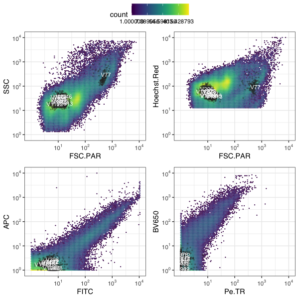

*Hexagonal color bins show event density for scatter, DNA and fluorescence channel pairs on logarithmic axes. Overlaid events and labels locate selected SOM populations within the complete sample distribution.*

## 13. Export selected populations

Save selected events for inspection in flow cytometry software. Export writes the supplied event values, so consider whether you want transformed or stored acquisition-scale values and retain channel names compatible with the source metadata.

``` r
# Use sample 1 consistently for processing and export metadata.
# Prepare acquisition-scale events with their original channel names.
export_dat <- MBR_process(fcs_files, file_index = 1, transformation = identity)

# Save selected gated populations/clusters as a new FCS file
# Run MBR_save with the inputs and settings below.
MBR_save(
  # list of input FCS files
  fcs_files = fcs_files,
  # acquisition-scale events from the same source sample
  dat = export_dat,
  # selected clusters to export
  selected_rows = c("V9", "V10"),
  # Choose this position in the input FCS sample list.
  file_index = 1,
  # directory containing raw FCS files
  rawdata_path = rawdata_path
# Complete the function call with the arguments above.
)
```

## 14. 16S rRNA gene sequencing

Compare 16S feature abundances between CD and HC and explore informative taxa with feature selection and classification. Ensure metadata matches the transposed sample order. This sample-level workflow is exploratory rather than a specialized sequencing count model.

``` r
# The feature table has taxa in rows and samples in columns.
# Use meta_final, matched to the transposed feature-table sample IDs.
# correction = "none" leaves p-values unadjusted.

# Pre-processing
# Load metadata and feature abundance table
# Read the matched 16S sample metadata.
meta_16s <- read.delim(
  # Read this downloaded file from the working directory.
  'bac_meta.txt',
  # Use the first file row as column headings.
  header = TRUE,
  # Use the first file column as row identifiers.
  row.names = 1
# Complete the function call with the arguments above.
)
# Read the taxa-by-sample feature table.
count_table_16s <- read.delim(
  # Read this downloaded file from the working directory.
  'bac_data.txt',
  # Use the first file row as column headings.
  header = TRUE,
  # Use the first file column as row identifiers.
  row.names = 1
# Complete the function call with the arguments above.
)

# This operation filters sample columns with zero totals, not taxon rows.
# Calculate totals for the sample columns of the imported 16S table.
col_sums <- colSums(count_table_16s)
# Retain sample columns with positive totals.
count_table_filtered <- count_table_16s[, col_sums > 0]

# Transpose the count table so that samples are rows and taxa are columns
# Transpose the feature table to samples in rows.
count_t <- as.data.frame(t(count_table_filtered))

# Reorder metadata to match the sample order in the feature table
# Reorder metadata rows to match the transposed sample identifiers.
meta_final <- meta_16s[rownames(count_t), ]


# Application of MicroBiotR
# Run MBR_stat with the inputs and settings below.
MBR_stat(
  # feature abundance table
  data = count_t,
  # column name in metadata containing group labels
  group_col = 'Group',
  # metadata files
  meta_data = meta_final,
  # statistical test method
  test_type = 'wilcox',
  # Write outputs to the current working directory.
  out_path = './',
  # Set whether feature-wise p-values are adjusted for multiple tests.
  correction = 'none',
  # Set the feature-selection threshold for the chosen p-value column.
  cutoff = 0.1
# Complete the function call with the arguments above.
)

# Run MBR_fs with the inputs and settings below.
MBR_fs(
  # input dataframe containing significant features
  significant_data,
  # Write outputs to the current working directory.
  out_path = './',
  # number of folds for cross-validation
  nfolds_cv = 5,
  # Largest requested subset size; caret also evaluates the full set.
  rfe_size = 125,
  # Number of selected features displayed in the importance plot.
  top_n_features = 10,
  # column name in metadata containing class/group labels
  group_name = 'Group',
  # metadata files
  meta_data = meta_final,
  # reference/control group used for comparison
  ref_group = 'CD',
  # colors used for visualization plots
  colors = c('#FFADAD', '#DEDAF4')
# Complete the function call with the arguments above.
)

# Run MBR_ml with the inputs and settings below.
MBR_ml(
  # feature table
  data = MBR_selected_features,
  # metadata files
  meta_data = meta_final,
  # column name in metadata containing group labels
  group_name = 'Group',
  # Write outputs to the current working directory.
  out_path = './',
  # reference group
  reference_level = 'CD',
  # width of the output plot PDF
  width = 6,
  # height of the output plot PDF
  height = 6,
  # resampling method
  method = 'repeatedcv',
  # number of folds
  number = 5,
  # number of repeats
  repeats = 2
# Complete the function call with the arguments above.
)
```

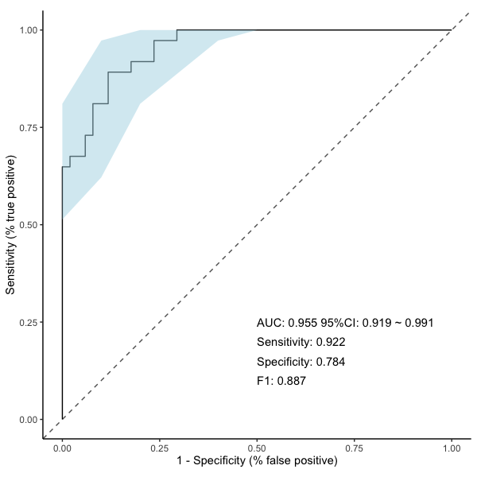

*The curve summarizes CD-versus-HC discrimination using selected 16S features. The shaded confidence band and displayed AUC, sensitivity, specificity and F1 describe the fitted example; selection on the same samples limits independent predictive interpretation.*

## 15. Transcriptomics

Compare the supplied RNA expression profiles between HC and UC. Confirm expression units and normalization before interpreting gene-level differences, and ensure metadata follows sample order. A classifier evaluated on the same samples used for gene selection remains exploratory.

``` r
# Use meta_final, matched to the transposed expression-table sample IDs.
# correction = "none" leaves gene p-values unadjusted.
# reference_level identifies the positive class for ROC and confusion metrics.

# Pre-processing
# Load metadata and feature abundance table
# Read the RNA sample metadata.
meta_rna <- read.delim(
  # Read this downloaded file from the working directory.
  'meta_rna.txt',
  # Use the first file row as column headings.
  header = TRUE,
  # Use the first file column as row identifiers.
  row.names = 1
# Complete the function call with the arguments above.
)
# Read the expression CSV with gene symbols and sample columns.
count_table_rna <- read_csv(
  # Read this downloaded file from the working directory.
  'rnaibd.csv'
# Complete the function call with the arguments above.
)

# Keep Symbol and numeric sample columns with positive totals.
# Retain Symbol and numeric columns with positive totals.
count_table_clean <- count_table_rna %>%
  # Select identifiers and the numeric columns described below.
  select(
    # Retain the gene identifier column.
    Symbol,
    # Keep numeric sample columns whose total is positive.
    where(~ is.numeric(.) && sum(., na.rm = TRUE) > 0)
  # Complete the function call with the arguments above.
  )

# Convert the `Symbol` column into row names so that genes become rows prior
# to transposition
# Use gene symbols as row identifiers before transposing.
count_df <- count_table_clean %>%
  # Convert the Symbol column into gene row names.
  column_to_rownames(var = "Symbol")

# Transpose the count table so that samples are rows and genes/features are
# columns
# Transpose the feature table to samples in rows.
count_t <- as.data.frame(t(count_df))

# Reorder metadata to match the sample order in the feature table
# Reorder metadata rows to match the transposed sample identifiers.
meta_final <- meta_rna[rownames(count_t), ]


# Application of MicroBiotR
# Run MBR_stat with the inputs and settings below.
MBR_stat(
  # feature abundance table
  data = count_t,
  # column name in metadata containing group labels
  group_col = 'Group',
  # metadata files
  meta_data = meta_final,
  # statistical test method
  test_type = 'wilcox',
  # Write outputs to the current working directory.
  out_path = './',
  # Set whether feature-wise p-values are adjusted for multiple tests.
  correction = 'none',
  # Set the feature-selection threshold for the chosen p-value column.
  cutoff = 0.00001
# Complete the function call with the arguments above.
)

# Run MBR_ml with the inputs and settings below.
MBR_ml(
  # feature table
  data = significant_data,
  # metadata files
  meta_data = meta_final,
  # column name in metadata containing group labels
  group_name = 'Group',
  # Write outputs to the current working directory.
  out_path = './',
  # reference group
  reference_level = 'UC',
  # width of the output plot PDF
  width = 6,
  # height of the output plot PDF
  height = 6,
  # resampling method
  method = 'repeatedcv',
  # number of folds
  number = 5,
  # number of repeats
  repeats = 2
# Complete the function call with the arguments above.
)
```

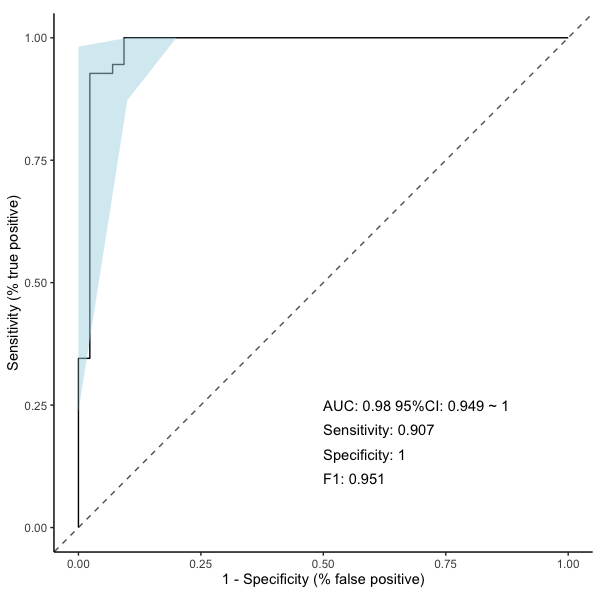

*The curve summarizes HC-versus-UC discrimination using selected expression features. The diagonal is the chance reference, the shaded band is the sensitivity confidence interval, and annotations summarize discrimination and classification metrics. These are exploratory results from the analyzed samples.*
