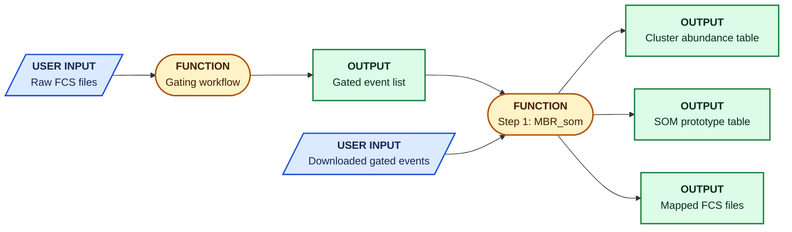
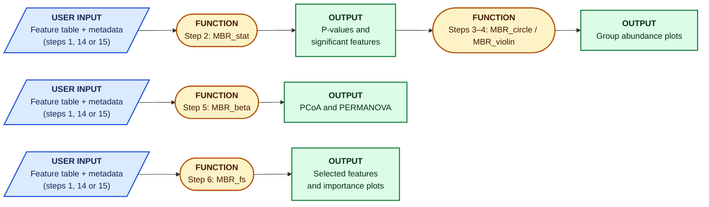
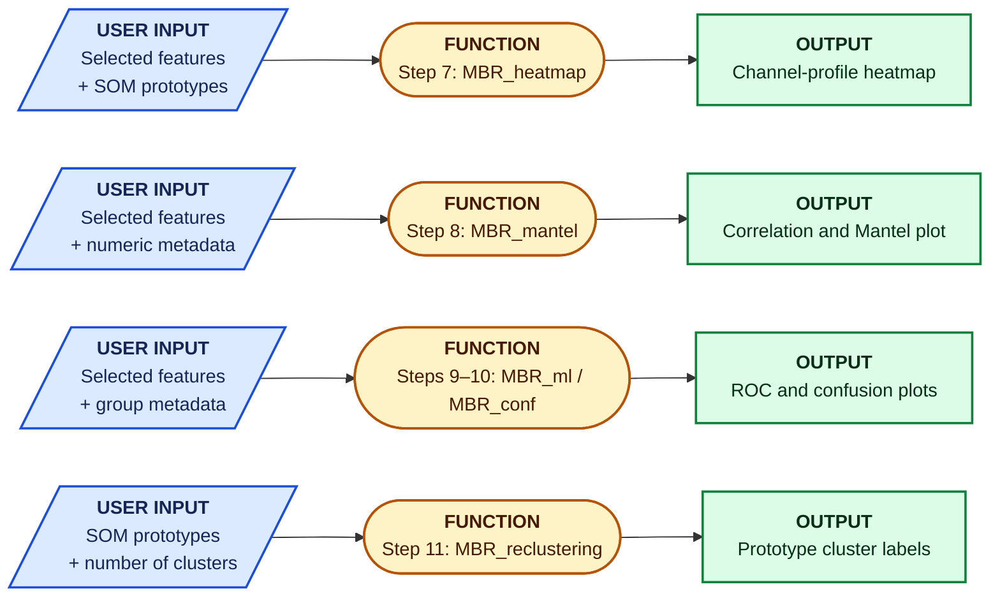
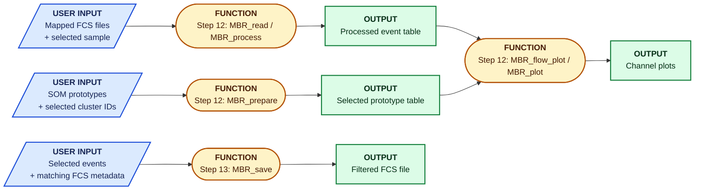

# Key feature diagram sources

The README figure uses the fixed-size vector layout in [key-features.svg](../figure/key-features.svg), exported to PNG for display. The Mermaid definitions below describe the workflow connections; their automatic layout may differ from the figure.

Blue parallelograms show user inputs, amber ovals show functions or scripts, and green rectangles show outputs. Each diagram follows a short workflow from left to right. An output named in one diagram can be supplied as input to another.

### Create shared flow-cytometry features

Start with raw FCS files and gating, or supply the downloaded gated events directly to `MBR_som`.

### Compare groups and select features

Use the SOM abundance table or a 16S/RNA feature table, together with matched sample metadata.

### Explore selected features and prototype profiles

Supply the selected features with the metadata or SOM prototype information needed by each analysis.

### Inspect and export flow populations

Read a mapped FCS sample and prepare the selected prototypes for channel plots. Export selected events with matching FCS metadata.

